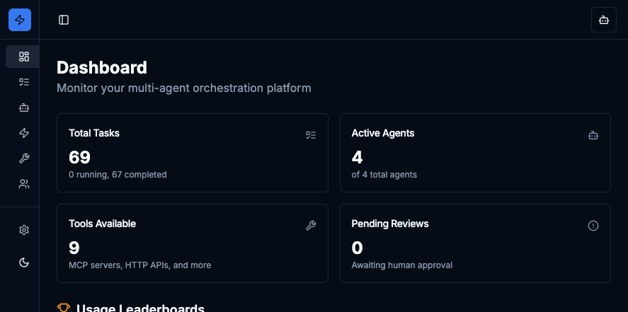
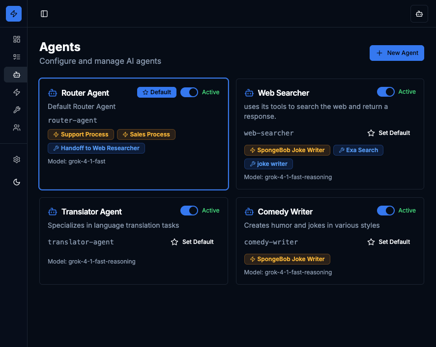
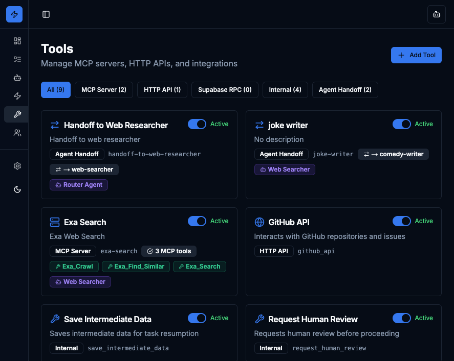

<p align="center">
  
</p>

<h1 align="center">⚡ SupaSwarm</h1>

<p align="center">
  <strong>A Supabase-native multi-agent orchestration platform</strong>
</p>

<p align="center">
  Build observable and governed agentic workflows using only Supabase services
</p>

<p align="center">
  <a href="#why-supaswarm">Why SupaSwarm?</a> •
  <a href="#integration-patterns">Integration</a> •
  <a href="#features">Features</a> •
  <a href="#quick-start">Quick Start</a> •
  <a href="#architecture">Architecture</a> •
  <a href="#contributing">Contributing</a>
</p>

<p align="center">
  
  
  
  
</p>

---

## Why SupaSwarm?

### 🔄 **Tired of SDK Migrations?**
Agent SDKs constantly change, break compatibility, and don't work when your client has different specs. SupaSwarm moves all agent logic to the database—deploy once, no client-side SDK headaches.

### 🌐 **Real-time Multi-Device Sync**
Users work across multiple devices. SupaSwarm leverages Supabase Realtime so your agents run in the cloud with instant updates everywhere—no polling, no stale state.

### 🚀 **No Client/Server Trigger Issues**
Struggling to trigger agents from different contexts? With database-native orchestration, any system that can write a row can trigger an agent.

---

## Integration Patterns

SupaSwarm is designed to plug into your existing workflows:

### 📊 **Database Triggers → Background Agents**
Have database records trigger new task records automatically. Insert a row in your `orders` table? Fire off an agent to process it. Background agents at your fingertips.

### 🔗 **n8n → External System Triggers**
Use [n8n](https://n8n.io) workflows to have external systems (webhooks, CRMs, email, Slack, etc.) trigger new tasks in your Supabase database. No custom API endpoints needed.

### 🛠️ **n8n MCP Servers → Agent Tools**
Wire up [n8n MCP servers](https://n8n.io/integrations/mcp-server-trigger/) to give your agents access to 500+ integrations. Need your agent to send emails, update Notion, or query Salesforce? Just connect the MCP server.

---

## Features

### 🎯 **100% Supabase-Native**
Built entirely on Supabase services—Postgres, Edge Functions, Realtime, Storage, and Vault. No external dependencies for core orchestration.

### 🤖 **Multi-Agent Orchestration**
- **Agent Registry**: Create and configure AI agents with custom system prompts
- **Agent Handoffs**: Seamlessly transfer tasks between specialized agents
- **Parallel Execution**: Run multiple tasks concurrently with aggregation

### 🔧 **Tool Integration**
- **MCP Servers**: Connect Model Context Protocol servers
- **HTTP APIs**: Integrate external REST endpoints
- **Supabase RPCs**: Call database functions directly
- **Agent Handoffs**: Route tasks between agents

### 📊 **Full Observability**
- **Task Hierarchy**: Three-ID system for tracking parent/child relationships
- **Chain of Thought**: View reasoning traces and tool calls
- **Real-time Updates**: Live task status via Supabase Realtime
- **Human Review Queue**: Escalation for uncertain decisions

### 📈 **Usage Analytics**
- **Agent Leaderboard**: Track your most-used agents
- **Tool Usage**: Monitor which tools are called most frequently
- **Skill Analytics**: See which skills drive the most automation

### 🔐 **Secure by Design**
- **Vault Integration**: All secrets stored in Supabase Vault
- **Zero Exposure**: No credentials in database rows or logs
- **RLS Ready**: Row Level Security compatible

### 🎨 **Modern Dashboard**
- **Linear/Vercel-inspired UI**: Clean, developer-focused design
- **Dark/Light Themes**: System-aware with manual toggle
- **Responsive Layout**: Works on desktop and mobile

<p align="center">
  
  
</p>

---

## Quick Start

### Prerequisites

- Node.js 18+
- A Supabase project ([create one free](https://supabase.com/dashboard))
- API key from at least one LLM provider (xAI, Anthropic, Google AI, or OpenAI)

### 1. Clone the Repository

```bash
git clone https://github.com/jlondrejcka/supaswarm.git
cd supaswarm
npm install
```

### 2. Configure Supabase

Copy the environment example and add your Supabase credentials:

```bash
cp .env.example .env
```

Edit `.env` with your Supabase project URL and anon key:

```env
NEXT_PUBLIC_SUPABASE_URL=https://your-project-id.supabase.co
NEXT_PUBLIC_SUPABASE_ANON_KEY=your-anon-key
```

### 3. Run Database Migration

Apply the schema to your Supabase project:

```bash
# Using Supabase CLI
supabase db push

# Or run the migration SQL directly in Supabase SQL Editor
# Copy contents from: supabase/migrations/00000000000000_init.sql
```

### 4. Deploy Edge Function

Deploy the task processor to Supabase:

```bash
supabase functions deploy process-task
```

### 5. Add LLM API Keys

Start the development server:

```bash
npm run dev
```

Open [http://localhost:3000/settings](http://localhost:3000/settings) and add your LLM provider API keys. These are stored securely in Supabase Vault.

### 6. Create Your First Agent

Navigate to [http://localhost:3000/agents](http://localhost:3000/agents) and create an agent with:
- **Name**: Your agent name
- **System Prompt**: Instructions for the agent
- **Model**: Select from available LLM models
- **Tools**: Assign tools the agent can use

---

## Architecture

### System Overview

```
┌─────────────────────────────────────────────────────────────┐
│                        Dashboard (Next.js)                   │
│  ┌─────────┐ ┌─────────┐ ┌─────────┐ ┌─────────┐ ┌─────────┐│
│  │  Tasks  │ │ Agents  │ │  Tools  │ │ Skills  │ │Settings ││
│  └────┬────┘ └────┬────┘ └────┬────┘ └────┬────┘ └────┬────┘│
└───────┼──────────┼──────────┼──────────┼──────────┼────────┘
        │          │          │          │          │
        ▼          ▼          ▼          ▼          ▼
┌─────────────────────────────────────────────────────────────┐
│                     Supabase Services                        │
│  ┌──────────────┐  ┌──────────────┐  ┌──────────────┐       │
│  │   Postgres   │  │Edge Functions│  │   Realtime   │       │
│  │  - tasks     │  │- process-task│  │- subscriptions│      │
│  │  - agents    │  │              │  │              │       │
│  │  - tools     │  └──────────────┘  └──────────────┘       │
│  │  - skills    │                                           │
│  └──────────────┘  ┌──────────────┐  ┌──────────────┐       │
│                    │    Vault     │  │   Storage    │       │
│                    │- API keys    │  │- artifacts   │       │
│                    └──────────────┘  └──────────────┘       │
└─────────────────────────────────────────────────────────────┘
```

### Task Hierarchy (Three-ID System)

```
Master Task (master_task_id = NULL)
├── Subtask A (parent_id = Master, master_task_id = Master)
│   └── Subtask A1 (parent_id = A, master_task_id = Master)
└── Subtask B (parent_id = Master, master_task_id = Master)
```

- **`id`**: Unique task identifier
- **`parent_id`**: Immediate parent (for subtask traversal)
- **`master_task_id`**: Root conversation task (for grouping)

### Task Status Flow

```
pending → running
          ├─→ completed
          ├─→ failed
          ├─→ cancelled
          ├─→ pending_subtask → (subtasks done) → pending
          └─→ needs_human_review → (human responds) → pending
```

---

## Usage

### Creating Tasks via Chat

1. Open the Tasks page
2. Click "New Task" to open the chat dialog
3. Select an agent from the dropdown
4. Type your message and send
5. Watch real-time updates as the agent processes

### Agent Handoffs

Configure agent-to-agent handoffs for specialized routing:

1. Create a "handoff" type tool pointing to the target agent
2. Assign the handoff tool to your router agent
3. The router can now delegate tasks to specialists

### Parallel Execution

Spawn multiple tasks to run concurrently:

1. Agent creates parallel tasks via the `spawn_parallel_tasks` tool
2. Each task runs independently
3. Aggregator task collects results when all complete

### Human-in-the-Loop

For high-stakes decisions, agents can request human review:

1. Agent calls `request_human_review` tool
2. Task moves to `needs_human_review` status
3. Human reviews and approves/rejects in the Reviews page
4. Task resumes with human feedback

---

## LLM Providers

| Provider | Vault Key | Default Model |
|----------|-----------|---------------|
| xAI (Grok) | `XAI_API_KEY` | grok-4-1 |
| Anthropic | `ANTHROPIC_API_KEY` | claude-sonnet-4-5-20250514 |
| Google AI | `GOOGLE_AI_API_KEY` | gemini-2.5-pro |
| OpenAI | `OPENAI_API_KEY` | gpt-4o |

Configure API keys in the Settings page. Keys are stored in Supabase Vault and never exposed in application code.

---

## Project Structure

```
supaswarm/
├── src/
│   ├── app/                 # Next.js App Router pages
│   │   ├── agents/          # Agent management
│   │   ├── tasks/           # Task list and detail views
│   │   ├── tools/           # Tool configuration
│   │   ├── skills/          # Skills management
│   │   ├── reviews/         # Human review queue
│   │   └── settings/        # LLM provider config
│   ├── components/          # React components
│   │   └── ui/              # shadcn/ui components
│   └── lib/                 # Utilities and types
├── supabase/
│   ├── functions/           # Edge Functions
│   │   └── process-task/    # Main task processor
│   └── migrations/          # Database schema
└── docs/
    └── screenshots/         # UI screenshots
```

---

## Development

### Running Locally

```bash
# Install dependencies
npm install

# Start development server
npm run dev

# Type checking
npm run check

# Build for production
npm run build
```

### Database Changes

1. Modify the migration file or create a new one
2. Apply with Supabase CLI: `supabase db push`
3. Generate types: `supabase gen types typescript > src/lib/supabase-types.ts`

### Edge Function Development

```bash
# Serve locally
supabase functions serve process-task --env-file .env

# Deploy
supabase functions deploy process-task
```

---

## Roadmap

### 🔮 **Coming Soon**

- **Human Observations Agent**: An AI agent that analyzes human task patterns to:
  - Identify repetitive workflows that can be automated
  - Suggest optimizations for existing agents
  - Auto-generate new skills and tools based on observed behavior
  - Continuously improve agent performance through feedback loops

Want to contribute to the roadmap? [Open an issue](https://github.com/jlondrejcka/supaswarm/issues) with your ideas!

---

## Contributing

Contributions are welcome! Please see [CONTRIBUTING.md](CONTRIBUTING.md) for guidelines.

1. Fork the repository
2. Create a feature branch: `git checkout -b feature/amazing-feature`
3. Commit your changes: `git commit -m 'Add amazing feature'`
4. Push to the branch: `git push origin feature/amazing-feature`
5. Open a Pull Request

---

## License

MIT License - see [LICENSE](LICENSE) for details.

---

## Acknowledgments

- [Supabase](https://supabase.com) - The backend platform
- [shadcn/ui](https://ui.shadcn.com) - UI components
- [Lucide](https://lucide.dev) - Icons
- [Vercel](https://vercel.com) - Design inspiration

---

<p align="center">
  <strong>Built with ⚡ by <a href="mailto:joe@cloudbeast.io">Joe Ondrejcka</a></strong>
</p>
