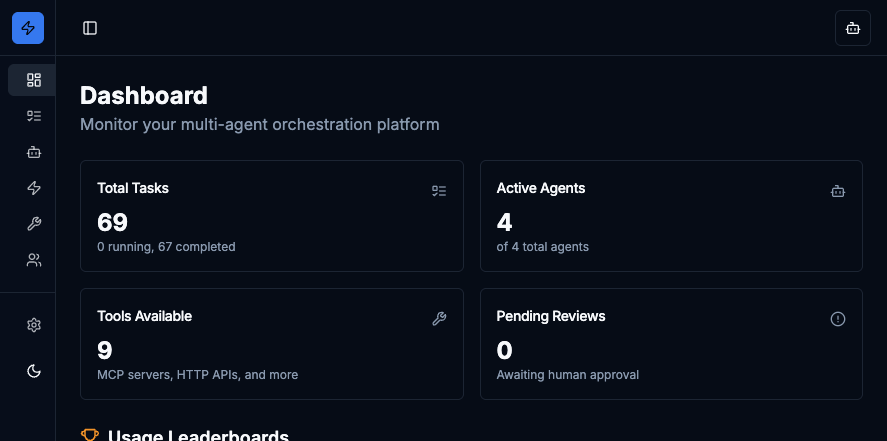
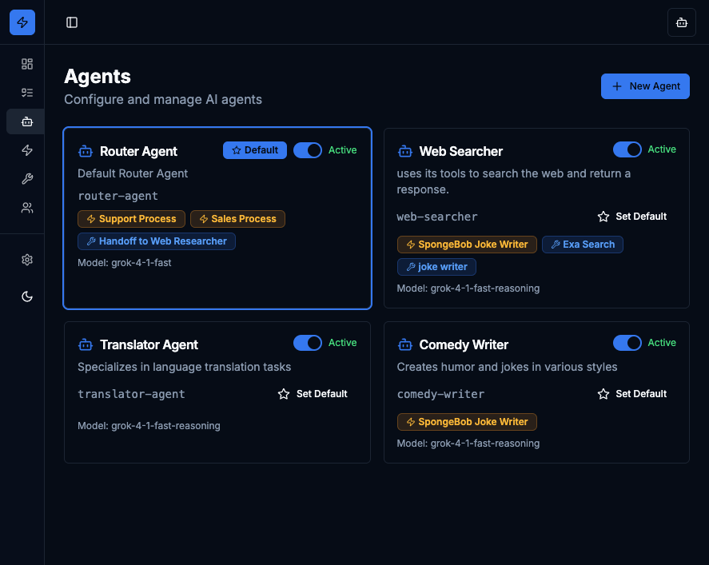
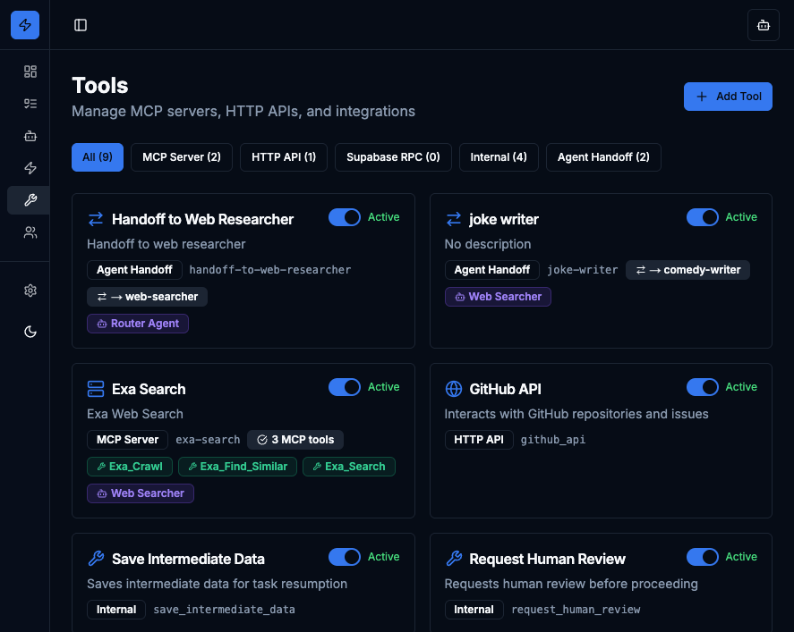

<p align="center">
  
</p>

<h1 align="center">⚡ SupaSwarm</h1>

<p align="center">
  <strong>The free, secure, Ollama-native alternative to OpenClaw</strong>
</p>

<p align="center">
  Local-first multi-agent orchestration with encrypted secrets, no exposed ports, and zero API costs using local LLMs
</p>

<p align="center">
  <a href="#why-not-openclaw">Why Not OpenClaw?</a> •
  <a href="#features">Features</a> •
  <a href="#quick-start">Quick Start</a> •
  <a href="#architecture">Architecture</a> •
  <a href="#usage">Usage</a> •
  <a href="#contributing">Contributing</a>
</p>

<p align="center">
  
  
  
  
  
</p>

---

## Why Not OpenClaw?

In January 2026, researchers found **42,665 exposed OpenClaw instances** — 93% vulnerable to remote code execution. API keys stored in plaintext. Default config binds to all network interfaces with no auth. [Source](https://clawctl.com/blog/42665-exposed-openclaw-instances)

SupaSwarm takes a different approach:

| | OpenClaw | SupaSwarm |
|---|---|---|
| **Secrets** | Plaintext in config files | Encrypted in Supabase Vault |
| **Network** | Binds `0.0.0.0`, trusts localhost | No exposed ports, no public URLs needed |
| **Auth** | None by default | RLS + service role isolation |
| **LLM Cost** | Requires paid API keys | Free with local Ollama models |
| **Setup** | 20-40hrs self-hosted, or $49/mo managed | `npm install && npm run dev` |
| **Architecture** | Standalone daemon process | Embedded in your Next.js app |
| **Observability** | Log files | Real-time dashboard with full task traces |
| **Multi-Agent** | Session-based coordination | DB-native delegation with auto-resume |

### Secure by Default
- **Vault-encrypted secrets** — API keys never in config files, env vars, or database rows
- **No open ports** — Slack via Socket Mode, tasks via internal API routes, no inbound webhooks
- **Row Level Security** — Every table RLS-enabled, service role isolated to worker

### Free to Run
- **Ollama-native** — First-class support for local models (Qwen, Llama, Mistral, etc.)
- **Zero API costs** — Full multi-agent orchestration without paying per-token
- **Cloud optional** — Add xAI, Anthropic, Google AI, or OpenAI per-agent when you need them

### Real-time Observability
Every tool call, delegation, and LLM response is logged and streamed via Supabase Realtime. Watch your agents think in real-time from any device.

### Zero SDK Lock-in
No agent SDK to learn or migrate from. Agents are database rows with system prompts, tool assignments, and skill configs. Any system that can insert a task row can trigger an agent.

---

## B2B Use Cases

Set up a scheduled agent in minutes. It runs on cron, searches the web with a local LLM, and delivers a summary to Slack. Zero API costs.

| Use Case | What the Agent Does | Schedule |
|---|---|---|
| **Competitive Analysis** | Scan competitor websites, blogs, product pages for changes, new features, messaging shifts | Weekly |
| **Pricing Intelligence** | Monitor competitor pricing pages, plan changes, new tiers — alert sales to undercut or match | Weekly |
| **Target Account Research** | Research prospect companies before outreach — tech stack, recent news, leadership changes | Daily |
| **ICP Research** | Analyze closed-won deals and market data to refine ideal customer profiles | Monthly |
| **Industry Analysis** | Summarize market trends, analyst reports, and news for your vertical | Weekly |
| **Job Posting Intelligence** | Track competitor hiring — 10 new SDR roles = scaling outbound, new "Head of AI" = investing there | Weekly |
| **Regulatory Monitoring** | Scan for new regulations, policy changes, enforcement actions in your industry | Daily |
| **Funding & M&A Tracking** | Monitor funding rounds, acquisitions, partnerships — newly funded companies have budget to spend | Daily |
| **Customer Risk Signals** | Track news about existing customers — layoffs, leadership changes, bad earnings = early churn warning | Daily |
| **Tech Stack Monitoring** | Scan job postings and tech directories to track what tools target accounts are adopting or dropping | Weekly |

Each use case = one agent + one scheduled job + one Slack channel. No code, no API costs, no human remembering to check 50 pages weekly.

---

## Features

### Multi-Agent Orchestration
- **Agent Registry** — Create agents with custom system prompts, LLM providers, and model selection
- **Delegation (Spawn)** — Agents spawn child agents for specialized sub-tasks, results auto-resume the parent
- **Handoffs** — Transfer full conversation context to another agent
- **Loop Prevention** — Delegation tools are automatically removed when resuming from a child result

### Tool System
- **MCP Servers** — Connect Model Context Protocol servers for 500+ integrations
- **HTTP APIs** — Call any REST endpoint as a tool
- **Supabase RPCs** — Execute database functions directly
- **Spawn/Handoff** — Route tasks between agents as tools

### Skills & Inheritance
- **Skill Library** — Reusable instruction sets agents can load on demand
- **Tool Inheritance** — Assigning a skill auto-inherits its associated tools
- **Lazy Loading** — Skills loaded via `load_skill` tool only when needed

### Scheduled Jobs
- **Cron Jobs** — Daily, weekly, monthly, or custom schedules
- **Slack Delivery** — Jobs can post results directly to a Slack channel
- **Run Tracking** — History of every run with status, error messages, and task links
- **Manual Trigger** — Run any job on demand from the UI

### Slack Integration (Socket Mode)
- **Per-Agent Bots** — Each agent can have its own Slack bot identity
- **Socket Mode** — No public URLs needed, works behind firewalls
- **Thread-Aware** — Messages in threads maintain session context
- **Bidirectional** — Receive events and post replies reliably

### Observability & Dashboard
- **Task Traces** — Full chain-of-thought, tool calls, and LLM responses
- **Session Management** — Group related tasks into sessions
- **Agent Leaderboard** — Track usage across agents, tools, and skills
- **Human Review Queue** — Escalation for uncertain decisions
- **Dark/Light Themes** — System-aware with manual toggle

### Security (Not an Afterthought)
- **Vault-Encrypted Secrets** — All API keys in Supabase Vault, not plaintext config files
- **No Exposed Ports** — No `0.0.0.0` binding, no public webhook URLs, no attack surface
- **RLS on Every Table** — Row Level Security enabled across the entire schema
- **Service Role Isolation** — Worker uses service role, UI uses anon key, never mixed

<p align="center">
  
  
</p>

---

## Quick Start

### Prerequisites

- Node.js 18+
- [Ollama](https://ollama.ai) — local LLM inference, completely free
- A Supabase project — [create one free](https://supabase.com/dashboard), or run locally with Docker
- No paid API keys required for local development

### 1. Clone & Install

```bash
git clone https://github.com/jlondrejcka/supaswarm.git
cd supaswarm
npm install
```

### 2. Configure Environment

```bash
cp .env.example .env.local
```

Edit `.env.local` with your Supabase credentials:

```env
# Remote Supabase project
NEXT_PUBLIC_SUPABASE_URL=https://your-project-id.supabase.co
NEXT_PUBLIC_SUPABASE_ANON_KEY=your-anon-key
SUPABASE_SERVICE_ROLE_KEY=your-service-role-key

# Or local Supabase (run: supabase start)
NEXT_PUBLIC_SUPABASE_URL=http://localhost:54321
```

### 3. Database Setup

```bash
# Push schema to your Supabase project
supabase db push

# Or link to remote and push
supabase link --project-ref your-project-id
supabase db push
```

### 4. Start Ollama

```bash
ollama serve
# Pull a model (in another terminal)
ollama pull qwen3:30b
```

### 5. Start Development Server

```bash
npm run dev
```

Open [http://localhost:3000](http://localhost:3000). The embedded worker starts automatically with the dev server — no separate process needed.

### 6. Configure LLM Providers

Open [http://localhost:3000/settings](http://localhost:3000/settings) to add API keys:

| Provider | Vault Key | Default Model |
|----------|-----------|---------------|
| Ollama (Local) | `OLLAMA_API_KEY` | Any pulled model |
| xAI (Grok) | `XAI_API_KEY` | grok-4-1 |
| Anthropic (Claude) | `ANTHROPIC_API_KEY` | claude-sonnet-4-5-20250514 |
| Google AI (Gemini) | `GOOGLE_AI_API_KEY` | gemini-2.5-pro |
| OpenAI (GPT) | `OPENAI_API_KEY` | gpt-4o |

For local development with Ollama, no paid API keys needed.

### 7. Create Your First Agent

Navigate to [http://localhost:3000/agents](http://localhost:3000/agents):
1. Create an agent with a name, system prompt, and Ollama model
2. Assign tools and skills
3. Open [http://localhost:3000/chat](http://localhost:3000/chat) to start chatting

---

## Architecture

### System Overview

```
┌─────────────────────────────────────────────────────────────┐
│                   Next.js Application                        │
│                                                              │
│  ┌──────────────┐  ┌──────────────┐  ┌──────────────┐       │
│  │   Dashboard   │  │  API Routes  │  │   Embedded   │       │
│  │  (React UI)   │  │ /api/process │  │    Worker    │       │
│  │              │  │ /api/jobs    │  │ (jobs, slack) │       │
│  └──────┬───────┘  └──────┬───────┘  └──────┬───────┘       │
│         │                 │                  │               │
│         │     ┌───────────┴──────────┐       │               │
│         │     │   Process Engine     │       │               │
│         │     │  (src/lib/engine/)   │◄──────┘               │
│         │     │  LLM loop, tools,   │                        │
│         │     │  delegation, spawn   │                        │
│         │     └───────────┬──────────┘                        │
│         │                 │                                   │
└─────────┼─────────────────┼───────────────────────────────────┘
          │                 │
          ▼                 ▼
┌─────────────────────────────────────────────────────────────┐
│                   Supabase (Data Layer)                       │
│  ┌──────────────┐  ┌──────────────┐  ┌──────────────┐       │
│  │   Postgres    │  │   Realtime   │  │    Vault     │       │
│  │  tasks,agents │  │ live updates │  │  API keys    │       │
│  │  sessions,    │  │ subscriptions│  │  secrets     │       │
│  │  tools,skills │  │              │  │              │       │
│  └──────────────┘  └──────────────┘  └──────────────┘       │
└─────────────────────────────────────────────────────────────┘
          │
          ▼
┌─────────────────────────────────────────────────────────────┐
│                   LLM Providers                              │
│  ┌────────┐  ┌────────┐  ┌────────┐  ┌────────┐  ┌────────┐│
│  │ Ollama │  │  xAI   │  │Anthropic│ │Google AI│ │ OpenAI ││
│  │(local) │  │ (Grok) │  │(Claude) │ │(Gemini) │ │ (GPT)  ││
│  └────────┘  └────────┘  └────────┘  └────────┘  └────────┘│
└─────────────────────────────────────────────────────────────┘
```

### How Task Processing Works

1. **Task Created** — UI, API, Slack, or scheduled job inserts a task row
2. **API Triggered** — `/api/process-task` is called with the task ID
3. **Engine Runs** — `process-task.ts` loads agent config, tools, and context
4. **LLM Loop** — Up to 10 iterations of LLM calls with tool execution
5. **Tool Calls** — MCP, HTTP, RPC, or spawn/handoff tools executed inline
6. **Completion** — Task marked complete, Slack replies sent if configured
7. **Parent Resume** — If this was a delegated child, parent auto-resumes with results

No queues, no edge functions, no external workers. Everything runs in-process.

### Task Status Flow

```
pending → running
          ├─→ completed
          ├─→ failed
          ├─→ cancelled
          ├─→ pending_subtask → (child completes) → pending → running → ...
          └─→ needs_human_review → (human responds) → pending
```

### Delegation Flow

```
Parent Agent (running)
  └─→ spawns Child Agent task
       Parent → pending_subtask (waiting)
       Child → running → completed
       DB trigger sets Parent → pending with _spawn_result
       Engine auto-resumes Parent (spawn/handoff tools removed to prevent loops)
       Parent → running → completed
```

---

## Usage

### Web Chat

Open `/chat`, select an agent, and type. Real-time streaming shows tool calls and responses as they happen.

### Slack

1. Create a Slack app at [api.slack.com/apps](https://api.slack.com/apps)
2. Enable Socket Mode and generate an App Token (`xapp-...`)
3. Add bot token and signing secret to Supabase Vault via `/channels`
4. Configure per-agent Slack bots in the Channels page

### Scheduled Jobs

Create recurring tasks at `/jobs`:
- Set schedule (daily, weekly, etc.)
- Assign an agent and task message
- Optionally set a Slack channel for delivery
- View run history and stats per job

### Agent Delegation

1. Create a "spawn" type tool pointing to a specialist agent
2. Assign it to your router agent
3. Router can now delegate sub-tasks; results auto-return

### Human-in-the-Loop

Agents can escalate to humans via `request_human_review`. Tasks pause until a human approves/rejects in the `/approvals` page.

---

## Project Structure

```
supaswarm/
├── src/
│   ├── app/                    # Next.js App Router
│   │   ├── agents/             # Agent CRUD
│   │   ├── chat/               # Web chat interface
│   │   ├── tasks/              # Task list & detail
│   │   ├── tools/              # Tool management
│   │   ├── skills/             # Skills library
│   │   ├── jobs/               # Scheduled jobs
│   │   ├── sessions/           # Session management
│   │   ├── channels/           # Slack bot config
│   │   ├── approvals/          # Human review queue
│   │   ├── settings/           # LLM provider config
│   │   ├── mission-control/    # Agent fleet overview
│   │   └── api/
│   │       ├── process-task/   # Task processing endpoint
│   │       ├── jobs/           # Job run triggers
│   │       └── ...             # Other API routes
│   ├── components/             # React components (shadcn/ui)
│   ├── instrumentation.ts      # Worker bootstrap (starts on dev server)
│   └── lib/
│       ├── engine/
│       │   ├── process-task.ts # Core LLM loop & tool execution
│       │   ├── llm-providers.ts# Provider abstraction
│       │   ├── mcp-client.ts   # MCP server integration
│       │   ├── skill-loader.ts # Skill loading
│       │   ├── task-logger.ts  # Execution logging
│       │   └── types.ts        # TypeScript interfaces
│       ├── worker/
│       │   └── index.ts        # Embedded worker (scheduled jobs)
│       └── slack/
│           ├── bolt-app.ts     # Slack Socket Mode handler
│           └── reply-handler.ts# Slack message posting
├── supabase/
│   ├── migrations/             # Database schema (versioned)
│   └── config.toml             # Local Supabase config
├── .env.example                # Environment template
└── package.json
```

---

## Environment Variables

| Variable | Default | Purpose |
|----------|---------|---------|
| `NEXT_PUBLIC_SUPABASE_URL` | `http://localhost:54321` | Supabase API endpoint |
| `NEXT_PUBLIC_SUPABASE_ANON_KEY` | — | Supabase anon/public key |
| `SUPABASE_SERVICE_ROLE_KEY` | — | Service role for worker operations |
| `NEXT_RUNTIME` | `nodejs` | Required for embedded worker |
| `OLLAMA_BASE_URL` | `http://localhost:11434/v1` | Local Ollama endpoint |
| `SLACK_SOCKET_MODE_ENABLED` | `true` | Enable Slack Socket Mode |

LLM API keys are stored in Supabase Vault (not env vars) and configured via the Settings page.

---

## Integration Patterns

### Database Triggers → Background Agents
Insert a row in any table, have a trigger create a task row, and an agent processes it automatically.

### n8n → External System Triggers
Use [n8n](https://n8n.io) to have external systems (webhooks, CRMs, email) create tasks via Supabase insert.

### MCP Servers → Agent Tools
Connect [n8n MCP servers](https://n8n.io/integrations/mcp-server-trigger/) to give agents access to 500+ integrations.

---

## Development

```bash
# Install
npm install

# Start Ollama
ollama serve

# Start dev server (includes embedded worker)
npm run dev

# Type checking
npm run check

# Production build
npm run build
```

### Database Changes

```bash
# Create new migration
supabase migration new my_change

# Push to remote
supabase db push

# Generate TypeScript types
supabase gen types typescript > src/lib/supabase-types.ts
```

---

## Migrating from OpenClaw

Already running OpenClaw? SupaSwarm replaces the core workflow:

| OpenClaw Concept | SupaSwarm Equivalent |
|---|---|
| Agent config (YAML/JSON) | Agent row in Postgres (edit via UI) |
| Tool definitions | Tool rows with MCP, HTTP, RPC, or spawn types |
| `sessions_spawn` | Spawn/handoff tools with auto-resume |
| `sessions_send` | Delegation with `_spawn_result` context injection |
| Plaintext API keys | Supabase Vault secrets (encrypted at rest) |
| Browser automation | MCP server tools |
| Cron schedules | Scheduled jobs with Slack delivery |

Your agents' system prompts and tool configurations transfer directly. No SDK migration needed.

---

## Roadmap

- **Automated Agent Optimization** — AI that analyzes task patterns to suggest workflow improvements
- **Context Graphs** — Visual knowledge graphs built from agent interactions
- **Multi-tenant** — Team-based access control and agent sharing
- **Agent Marketplace** — Share and import agent configurations

[Open an issue](https://github.com/jlondrejcka/supaswarm/issues) with ideas!

---

## Contributing

Contributions welcome! See [CONTRIBUTING.md](CONTRIBUTING.md).

1. Fork the repository
2. Create a feature branch: `git checkout -b feature/amazing-feature`
3. Commit your changes: `git commit -m 'Add amazing feature'`
4. Push: `git push origin feature/amazing-feature`
5. Open a Pull Request

---

## License

MIT License — see [LICENSE](LICENSE).

---

## Acknowledgments

- [Supabase](https://supabase.com) — Data layer and real-time
- [Ollama](https://ollama.ai) — Local LLM inference
- [Cursor](https://cursor.com) — Development environment
- [shadcn/ui](https://ui.shadcn.com) — UI components
- [Lucide](https://lucide.dev) — Icons

---

<p align="center">
  <strong>Built with ⚡ by <a href="mailto:joe@cloudbeast.io">Joe Ondrejcka</a></strong>
</p>
